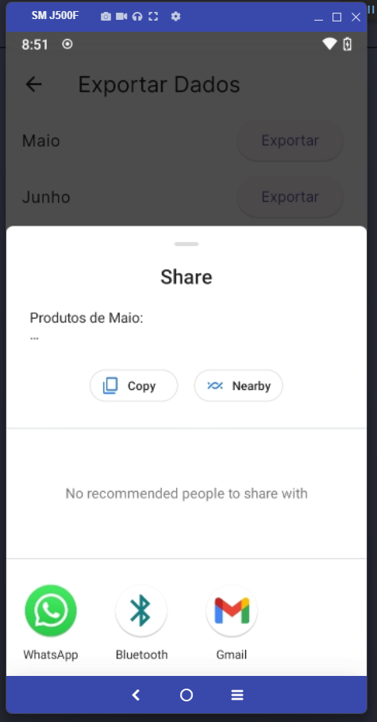

# padaria-sustentavel-app

Stock control project for bakeries - Avoid wasting food 

Sustainable bakery

### Using google ml kit to read an image and its registration information

  google_mlkit_text_recognition: ^0.13.0
  image_picker: ^1.1.1

add in AndroidManifest 

    <uses-permission android:name="android.permission.CAMERA" />

### Preview

  

